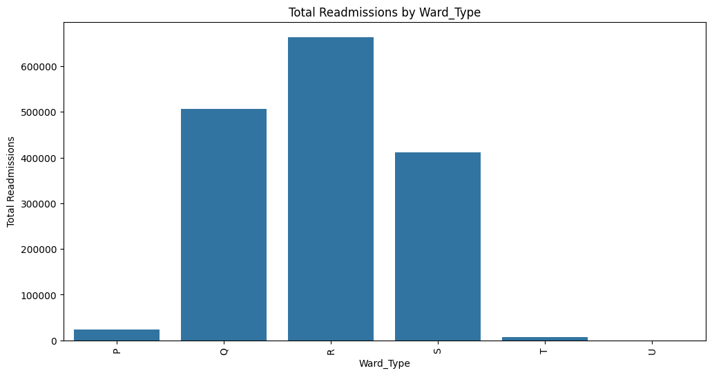
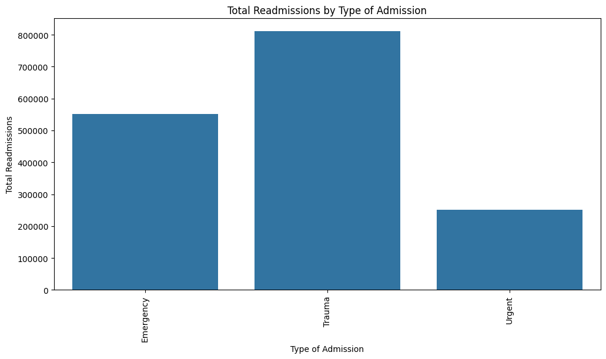
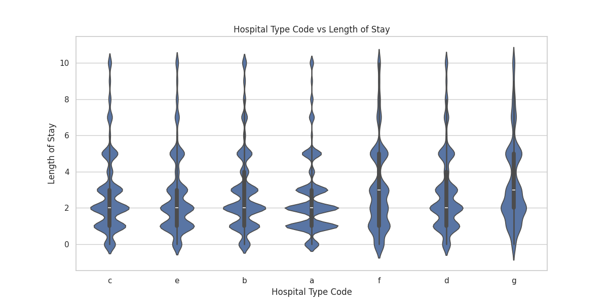
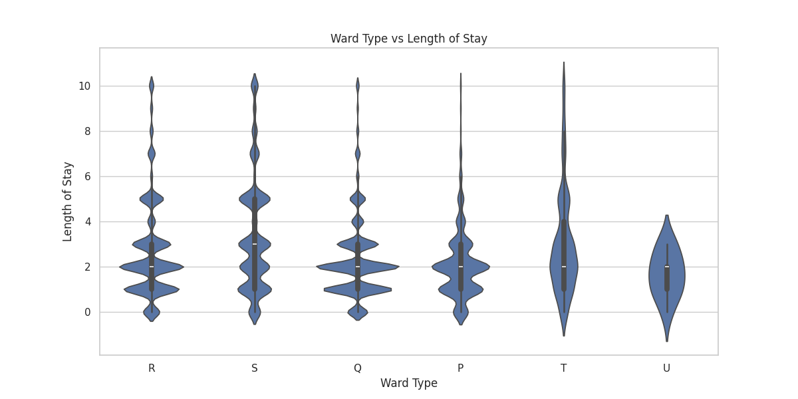
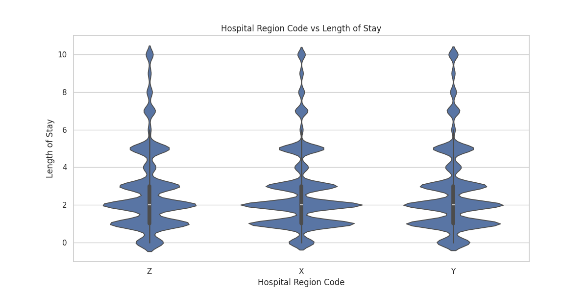
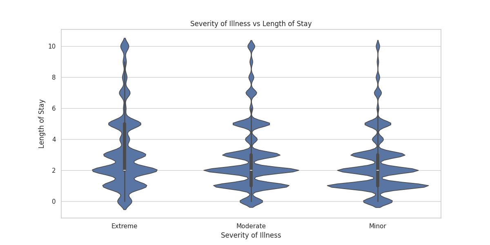
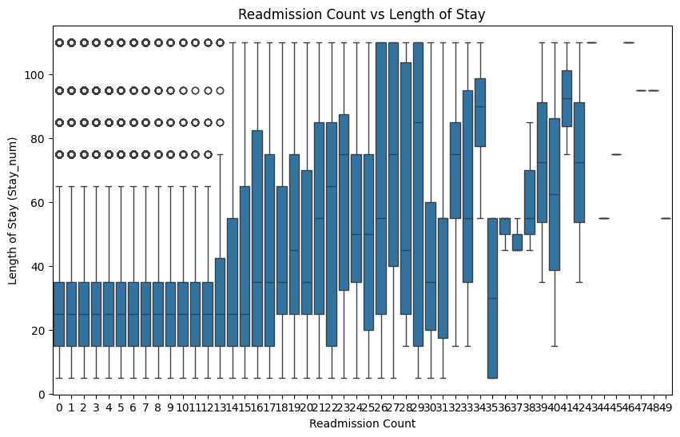

# UC-Berkeley-ML-AI---Capstone_Work_Sample
# Comprehensive EDA Insight Report

## Executive Summary

This report provides an exploratory data analysis (EDA) of a hospital dataset to uncover patterns and insights related to patient readmissions and length of stay. The analysis focuses on various factors such as hospital type, ward type, admission type, severity of illness, and other key features. The goal is to provide actionable insights for hospital management and policy-making to enhance patient care and optimize hospital operations.

## Key Insights

### Patient Readmissions

#### Total Readmissions by Hospital Type

- **Observation**: Hospital type 'a' has the highest number of readmissions, followed by types 'b' and 'c'.
- **Interpretation**: This suggests that hospital type 'a' might be handling more complex cases or has a larger capacity.

#### Total Readmissions by City Code Hospital

- **Observation**: Cities with hospital codes '1' and '2' have the highest readmissions.
- **Interpretation**: Indicates these hospitals are likely in urban areas with higher patient inflow.

#### Total Readmissions by Hospital Region

- **Observation**: Regions 'X' and 'Y' have higher readmissions compared to region 'Z'.
- **Interpretation**: Suggests regional differences in hospital capacities or patient demographics.

#### Total Readmissions by Department

- **Observation**: Gynecology department has the highest readmissions.
- **Interpretation**: This could indicate a higher volume of cases or a need for specialized follow-up care in this department.

#### Total Readmissions by Ward Type

- **Observation**: Ward type 'R' has the highest number of readmissions, followed by ward types 'Q' and 'S'. Ward types 'P', 'T', and 'U' have significantly lower readmissions.
- **Interpretation**: This suggests that ward type 'R' handles a higher volume of patients or more complex cases that lead to higher readmissions. The lower readmissions in ward types 'P', 'T', and 'U' may indicate either lower patient volumes or more effective patient management.

#### Total Readmissions by Ward Facility Code

- **Observation**: Ward facility code 'F' has the highest number of readmissions, followed by codes 'E' and 'D'. Codes 'A', 'B', and 'C' have lower readmissions.
- **Interpretation**: This indicates that ward facility 'F' might be serving a larger or more critically ill patient population, resulting in higher readmissions. Facilities 'A', 'B', and 'C' might have better discharge planning or serve less critical cases.

#### Total Readmissions by Type of Admission

- **Observation**: Trauma admissions have the highest number of readmissions, followed by emergency admissions. Urgent admissions have the lowest readmissions.
- **Interpretation**: The higher readmissions for trauma cases reflect the critical and often complex nature of these patients, requiring more frequent readmissions. Emergency cases also show high readmissions due to their acute nature, while urgent cases have comparatively lower readmissions.

#### Total Readmissions by Severity of Illness

- **Observation**: Patients with moderate severity of illness have the highest number of readmissions, followed by those with extreme and minor severity.
- **Interpretation**: This suggests that patients with moderate severity of illness are more likely to be readmitted, possibly due to ongoing health issues that require repeated hospital care. Patients with extreme severity might have higher mortality rates or more intensive care leading to fewer readmissions, while those with minor severity are less likely to be readmitted.

### Length of Stay

#### Length of Stay by Hospital Type

- **Observation**: Variability in the length of stay is observed across different hospital types.
- **Interpretation**: Hospital type 'a' has more variability, suggesting it handles a broader range of patient conditions.

#### Length of Stay by Department

- **Observation**: Departments such as surgery and TB & Chest disease show longer lengths of stay.
- **Interpretation**: This is expected as these departments typically handle more severe or complex cases.

#### Length of Stay by Ward Type

- **Observation**: Ward types 'T' and 'U' have longer lengths of stay.
- **Interpretation**: Indicates these wards may cater to more critical or long-term care patients.

#### Length of Stay by City Code Hospital

- **Observation**: Consistent length of stay across various city codes, but some variability is seen indicating different patient management practices.

#### Length of Stay by Hospital Region

- **Observation**: Similar length of stay patterns across regions 'X', 'Y', and 'Z'.
- **Interpretation**: Indicates a standardized approach to patient care and management across regions.

#### Length of Stay by Type of Admission

- **Observation**: Trauma admissions tend to have longer stays compared to emergency and urgent admissions.
- **Interpretation**: Reflects the critical nature of trauma cases requiring extended care.

#### Length of Stay by Severity of Illness

- **Observation**: As expected, patients with extreme severity of illness have longer stays.
- **Interpretation**: Emphasizes the need for intensive care and prolonged treatment for more severe cases.

### Other Observations

#### Correlation Matrix

- **Observation**: Number of visitors with patients shows a positive correlation with the length of stay.
- **Interpretation**: Suggests that patients with more visitors might be staying longer due to more severe conditions or extended recovery times.

#### Distribution of Admission Deposits

- **Observation**: Admission deposits show a normal distribution with most values clustering around the mean.
- **Interpretation**: Indicates a standardized billing approach across different admissions.

#### Distribution of Visitors with Patients

- **Observation**: Majority of patients have 0-5 visitors, with a sharp drop-off beyond that.
- **Interpretation**: Reflects social support patterns for hospitalized patients.

## Recommendations

- **Focus on High Readmission Departments**: Departments like gynecology with high readmissions should be assessed for possible improvements in patient follow-up care and discharge planning.
- **Regional and Hospital Type Differences**: Address discrepancies in readmission and length of stay across different regions and hospital types to ensure uniformity in patient care.
- **Enhance Trauma Care Facilities**: Given the longer stays for trauma admissions, hospitals should ensure adequate resources and specialized care for these patients.
- **Patient Support Programs**: Implement programs to support patients with longer lengths of stay, including social support and post-discharge follow-ups.

From the distribution from readmission and length of stay across features, I have notice that readmission and length of stay distribution has similar pattern. However, note that not all features that has the same distribution pattern bettewn readmission and length of stay. For example, ward facility code has the highest readmission in code F. But all ward facility codes exhibit a similar pattern in length of stay, with a high concentration of shorter stays (1-3 days).

### Insights from Readmission and Length of Stay Patterns in Categorical Features

The summary statistics and visualizations suggest a pattern where patients with higher readmission counts tend to have longer stays. This pattern can also be observed across different categorical features, such as the type of admission, severity of illness, and hospital departments. Here are some specific insights:

#### 1. Type of Admission

- **Emergency**: Patients admitted through emergency services tend to have varied lengths of stay, with a noticeable portion having longer stays. This category also sees frequent readmissions, indicating that patients admitted in emergencies may require longer recovery times and are more likely to be readmitted.
- **Trauma**: Trauma cases show a higher readmission count, and these patients also tend to have longer stays. This suggests that trauma patients often require extensive care and follow-up treatments, leading to longer hospital stays and higher readmission rates. Refer to the [Total Readmissions by Type of Admission](#total-readmissions-by-type-of-admission) and [Type of Admission vs Length of Stay](#length-of-stay-by-type-of-admission) images.
- **Urgent**: Urgent admissions also display a pattern of higher readmission counts and longer lengths of stay, though not as pronounced as trauma cases. This indicates that urgent cases, while serious, might not require as prolonged care as trauma cases but still exhibit a significant need for readmission and extended stays.

#### 2. Severity of Illness

- **Extreme**: Patients with extreme severity of illness have the longest lengths of stay and highest readmission counts. This is expected, as more severe cases generally require longer hospitalization and are at a higher risk of complications leading to readmission. Refer to the [Severity of Illness vs Length of Stay](#length-of-stay-by-severity-of-illness) and [Total Readmissions by Severity of Illness](#total-readmissions-by-severity-of-illness) images.
- **Moderate**: Patients with moderate severity show a balanced pattern but still exhibit significant lengths of stay and readmission counts, indicating that even moderate cases can be complex and require careful management.
- **Minor**: Minor severity cases have the shortest stays and lowest readmission counts, suggesting that these patients recover quicker and have a lower likelihood of complications that necessitate readmission.

#### 3. Hospital Departments

- **Radiotherapy**: Patients in the radiotherapy department have varied lengths of stay, with a significant number having longer stays. This department also sees higher readmission rates, likely due to the ongoing nature of cancer treatments.
- **Anesthesia**: The anesthesia department has moderate lengths of stay and readmission counts, reflecting the typical recovery times associated with surgical procedures.
- **Gynecology**: Gynecology patients generally have shorter stays and lower readmission counts, suggesting efficient treatment and recovery processes. Refer to the [Total Readmissions by Department](#total-readmissions-by-department) image.
- **TB & Chest disease**: This department shows higher lengths of stay and readmission counts, indicating the complexity and chronic nature of respiratory illnesses. Refer to the [Department vs Length of Stay](#length-of-stay-by-department) image.
- **Surgery**: Surgical patients exhibit a broad range of stay lengths and readmission rates, depending on the type and severity of the surgery performed.

### Confirming the Pattern: Readmission and Length of Stay

1. **Readmission Count vs. Length of Stay**
   

   - The box plot indicates a general trend where higher readmission counts are associated with longer lengths of stay. Patients with more frequent readmissions tend to have a higher median length of stay, especially noticeable beyond 10 readmissions.

2. **Cumulative Stay vs. Length of Stay**
   

   - The scatter plot shows the distribution of cumulative stays in relation to individual lengths of stay. While there are some outliers, the data points suggest that patients with longer individual stays tend to accumulate more days in the hospital overall, reinforcing the pattern observed in the readmission count.
### Implications

These insights imply that:

- **Higher Readmission and Length of Stay**: Certain categories, such as trauma admissions and patients with extreme severity of illness, consistently show higher readmission counts and longer lengths of stay. This suggests that these patient groups are particularly vulnerable and may benefit from more intensive post-discharge care and monitoring to reduce readmissions and hospital stay durations.
- **Focused Interventions**: Hospitals can implement targeted interventions for high-risk groups, such as trauma and severe illness patients, to manage their care more effectively. This could include enhanced discharge planning, follow-up care, and outpatient support to reduce the likelihood of readmission and shorten hospital stays.
- **Resource Allocation**: Understanding these patterns can help hospitals allocate resources more efficiently. Departments with higher readmission rates and longer stays may require additional staff, specialized equipment, or dedicated programs to manage patient care more effectively.

